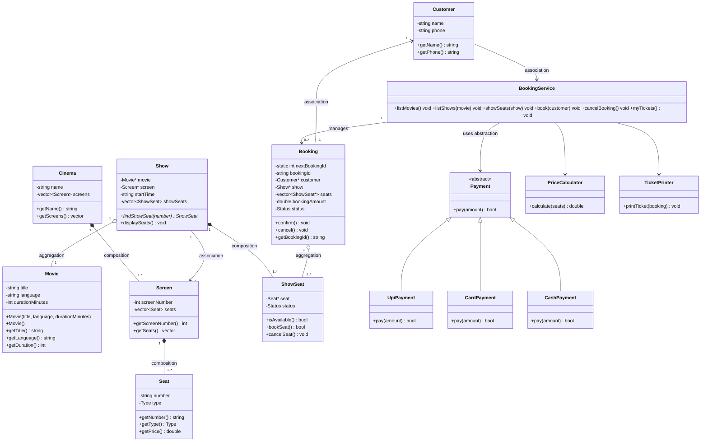

# TCS-504 System Design — Assignment 1

## A. Requirement Analysis

### Functional Requirements
- **FR1 — Movie listing:** The system shall display every movie currently playing with its title, language and duration when the customer selects Movies.
- **FR2 — Show listing:** After a customer chooses a movie, the system shall display all shows for that movie with screen number and start time.
- **FR3 — Seat layout:** After a customer chooses a show, the system shall display every seat with its seat type and AVAILABLE or BOOKED status.
- **FR4 — Booking:** A customer selects one or more seat numbers for a show. If any selected seat is already BOOKED, the whole booking is rejected and no seat changes state. Booking is confirmed only after payment succeeds.
- **FR5 — Pricing:** The system shall calculate the booking total as SILVER ₹150, GOLD ₹250 and PLATINUM ₹400 for each selected seat.
- **FR6 — Payment:** Exactly one payment method (UPI, Card or Cash) shall be used per booking. If payment fails, seats remain AVAILABLE and the booking is not confirmed.
- **FR7 — Ticket:** After successful payment, the system shall print booking ID, movie, screen, start time, seat numbers, total amount and confirmation status.
- **FR8 — Cancellation:** A customer shall be able to cancel a confirmed booking; every seat belonging to that booking shall become AVAILABLE again.

### Non-Functional Requirements
- **NFR1 Modularity:** The design shall keep responsibilities separated into classes and source files; no header files are used, as required by the assignment.
- **NFR2 Extensibility:** Payment behavior shall be abstracted so another payment type can be added by deriving from `Payment` without changing existing payment implementations.
- **NFR3 Robust input validation:** Invalid menu choices, movie/show choices and seat numbers shall produce a clear message without crashing.
- **NFR4 Maintainability:** Functions use intention-revealing names, constants for seat prices, small responsibilities and no unnecessary repeated logic.

## B. Noun–Verb Analysis

| Noun found | Keep as class? | Reason |
|---|---|---|
| Movie | Yes | Has its own data and identity. |
| Seat | Yes | Has number, type and price. |
| Seat layout | No | It is a view of a Show's seats, so it is a display method. |
| Screen | Yes | Represents one auditorium and owns physical seats. |
| Cinema | Yes | Represents the theatre and owns screens. |
| Show | Yes | Represents a movie screening on a screen at a time. |
| ShowSeat | Yes | Stores status of one physical seat for one show. |
| Customer | Yes | Stores customer identity data. |
| Booking | Yes | Stores booking identity, show, seats, amount and status. |
| Payment | Yes (abstract) | Defines a payment contract. |
| UPI / Card / Cash | Yes (implementations) | Each provides a concrete payment behavior. |
| Price | No | Pricing is behavior performed by `PriceCalculator`. |
| Ticket | No | The assignment asks for printing; ticket formatting is handled by `TicketPrinter`. |
| Booking flow | No | It is orchestration behavior, not an entity; handled by `BookingService`. |
| Menu | No | It is a console interaction mechanism; handled by `main`. |

**Important verbs:** list, choose, display, book, reject, price, pay, print, cancel, release, validate. These verbs become methods/behaviors distributed according to single responsibility.

## C. Class Responsibilities — knows / does / must NOT do

| Class | Knows | Does | Must NOT do |
|---|---|---|---|
| Movie | title, language, duration | Provides movie data | Manage seats, payments or tickets |
| Seat | number, type, price | Provides physical seat information | Track per-show booking state |
| Screen | screen number, seats | Owns physical seats | Process bookings/payments |
| Cinema | name, screens | Owns cinema screens | Calculate prices or print tickets |
| Show | movie, screen, start time, ShowSeats | Displays seats and finds a ShowSeat | Process payment |
| ShowSeat | Seat reference, status | Validates/book/cancels its show-seat status | Calculate full booking total |
| Customer | name, phone | Provides customer identity | Process payment or print tickets |
| Booking | ID, customer, show, seats, amount, status | Tracks booking state | Print its own ticket |
| Payment | payment contract | Defines `pay(amount)` | Know booking UI or seat layout |
| UpiPayment/CardPayment/CashPayment | Method-specific payment input | Execute payment behavior | Change booking status directly |
| PriceCalculator | Seat prices through Seat | Calculates total | Book seats or print tickets |
| TicketPrinter | Booking data needed for output | Formats and prints ticket | Change booking/seat state |
| BookingService | Cinema, movies, shows, bookings and services | Orchestrates end-to-end booking/cancellation | Implement concrete payment logic or ticket formatting |
| main / menu | Console input/output | Runs menu and delegates work | Contain business rules |

## D. Class Diagram



## E. Sequence Diagram — Customer books 1 seat and pays by UPI

```mermaid
sequenceDiagram
    actor customer
    participant bookingService
    participant show
    participant showSeat
    participant priceCalculator
    participant booking
    participant payment
    participant ticketPrinter

    customer->>+bookingService: choose movie and show
    bookingService->>+show: displaySeats()
    show->>+showSeat: isAvailable()
    showSeat-->>-show: true
    show-->>-bookingService: seat layout
    bookingService-->>customer: seat A1 is AVAILABLE

    customer->>+bookingService: select A1
    bookingService->>+show: findShowSeat("A1")
    show-->>-bookingService: showSeat
    bookingService->>+priceCalculator: calculate([A1])
    priceCalculator-->>-bookingService: ₹150
    bookingService-->>customer: total ₹150

    create participant booking as Booking
    bookingService->>+booking: «create» Booking(customer, show, A1, ₹150)
    booking-->>-bookingService: pending booking

    create participant payment as UpiPayment
    bookingService->>+payment: «create» UpiPayment(upiId)
    bookingService->>payment: pay(₹150)
    payment-->>-bookingService: true
    bookingService->>showSeat: bookSeat()
    showSeat-->>bookingService: true
    bookingService->>booking: confirm()
    bookingService->>+ticketPrinter: printTicket(booking)
    ticketPrinter-->>-bookingService: printed
    bookingService-->>-customer: booking confirmed + ticket
```

## F. Modular Working Code + Demo Run

### Compile

`g++ -std=c++17 main.cpp -o movie_booking`

### Demo scenarios

**Successful UPI booking:** choose `2 → movie 1 → show 1 → A1 → UPI`, then enter any UPI ID except `fail`. A confirmed ticket is printed with a booking ID such as `BK1001`.

**Already-booked seat:** repeat booking for `A1`; the program reports that the seat is already BOOKED and makes no seat changes.

**Failed payment:** choose an available seat and UPI/Card, then enter `fail`. The program reports payment failure; the booking is not confirmed and seats remain AVAILABLE.

**Cancellation:** use `3`, enter the confirmed booking ID, then display the same show's seats. The cancelled seat is AVAILABLE again.

**Invalid input:** invalid menu/movie/show/seat choices are rejected with clear messages.

## G. SOLID Mapping

| Principle | Implementation |
|---|---|
| **S — Single Responsibility** | `PriceCalculator` only prices; `TicketPrinter` only prints; `BookingService` orchestrates. |
| **O — Open/Closed** | New payment types can implement `Payment` without changing the existing payment classes or payment contract. |
| **L — Liskov Substitution** | UPI, Card and Cash implementations are usable through `Payment`. |
| **D — Dependency Inversion** | Booking flow uses `unique_ptr<Payment>` and calls `pay()` through the abstraction. |

**Deliberately NOT done:** database persistence/authentication was not added because the assignment says to build exactly the small single-cinema console scope.

## Edge Cases Covered
1. Already-booked seat → rejected, nothing changes.
2. Failed payment → booking not confirmed; seats remain AVAILABLE.
3. Cancellation → seats become AVAILABLE again.
4. Invalid menu/seat/show input → clear message, no crash.
